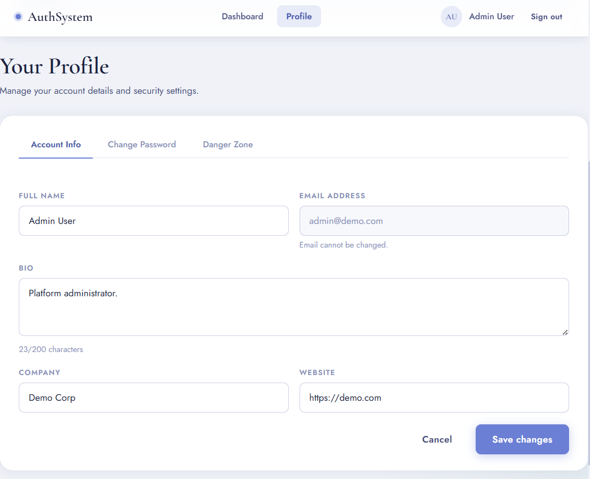

#  AuthSystem

A production-ready full-stack authentication system built with **Node.js**, **Express**, **JWT**, and **bcrypt**. Features a clean, responsive UI across 6 pages with complete user lifecycle management — from registration to session revocation.

---


##  Preview

### Login Page


### Dashboard Overview


### Profile


### Change Password


### Active Sessions


### JWT Inspector


### Forgot Password


### Reset Link Sent


### Danger Zone


##  Pages Overview

| Page | Route | Description |
|------|-------|-------------|
| Login | `/login` | Email + password sign-in with demo credentials |
| Register | `/register` | Account creation with live password strength meter |
| Forgot Password | `/forgot` | Request a time-limited reset link |
| Reset Password | `/reset?token=...` | Set a new password via token URL |
| Dashboard | `/dashboard` | Overview, session manager, JWT inspector, admin panel |
| Profile | `/profile` | Edit profile info, change password, danger zone |

---

##  Project Structure

```
auth-system/
├── package.json              # Dependencies & npm scripts
├── server/
│   └── index.js              # Express server — all API routes & auth logic
└── public/
    ├── css/
    │   └── style.css         # Full design system (variables, components, layouts)
    ├── js/
    │   └── auth.js           # Shared client utilities (fetch, alerts, strength meter)
    └── pages/
        ├── login.html        # Sign-in page
        ├── register.html     # Account creation page
        ├── forgot.html       # Password reset request
        ├── reset.html        # New password form (token-based)
        ├── dashboard.html    # Protected dashboard
        └── profile.html      # Profile settings & security
```

---

##  Tech Stack

| Layer | Technology |
|-------|-----------|
| Runtime | Node.js |
| Framework | Express 4 |
| Authentication | JSON Web Tokens (`jsonwebtoken`) |
| Password Hashing | bcrypt (`bcryptjs`, 12 rounds) |
| Session Cookies | `cookie-parser` (httpOnly, sameSite) |
| ID Generation | `uuid` v4 |
| Dev Server | `nodemon` |
| Frontend | Vanilla HTML, CSS, JavaScript (no frameworks) |
| Fonts | Cormorant Garamond, Jost, JetBrains Mono (Google Fonts) |

---

##  Getting Started

### Prerequisites

- **Node.js** v16 or higher — download from [nodejs.org](https://nodejs.org) (choose LTS)
- **npm** — comes bundled with Node.js
- A terminal (VS Code integrated terminal, Command Prompt, or PowerShell)

### Installation & Running

**1. Clone or download the project**

```bash
# If using git
git clone <your-repo-url>
cd auth-system

# Or just open the folder in VS Code: File → Open Folder → auth-system
```

**2. Install dependencies** *(only needed once)*

```bash
npm install
```

**3. Start the development server** *(auto-restarts on file save)*

```bash
npm run dev
```

**Or start without auto-reload:**

```bash
npm start
```

**4. Open in your browser**

```
http://localhost:3000
```

You'll see this in the terminal when it's ready:

```
  AuthSystem running → http://localhost:3000

  ✓ Demo credentials seeded:
    Email:    admin@demo.com
    Password: Admin@1234
```

### Stop the server

Press `Ctrl + C` in the terminal.

---

##  Demo Credentials

A seed admin account is created automatically every time the server starts:

| Field | Value |
|-------|-------|
| Email | `admin@demo.com` |
| Password | `Admin@1234` |
| Role | `admin` |

> The admin account gets access to the **Admin Panel** on the dashboard, which lists all registered users.

---

## 🔌 API Reference

All API routes are prefixed with `/api`. Protected routes require a valid JWT cookie (`token`).

### Auth

| Method | Route | Auth | Description |
|--------|-------|------|-------------|
| `POST` | `/api/register` | ✗ | Create a new account |
| `POST` | `/api/login` | ✗ | Sign in, receive JWT cookie |
| `POST` | `/api/logout` | ✓ | Invalidate current session |
| `POST` | `/api/forgot-password` | ✗ | Generate a password reset token |
| `POST` | `/api/reset-password` | ✗ | Set new password using reset token |

### User

| Method | Route | Auth | Description |
|--------|-------|------|-------------|
| `GET` | `/api/me` | ✓ | Get current user + active sessions |
| `PUT` | `/api/profile` | ✓ | Update name, bio, company, website |
| `PUT` | `/api/change-password` | ✓ | Change password (revokes other sessions) |
| `DELETE` | `/api/account` | ✓ | Permanently delete account |

### Sessions

| Method | Route | Auth | Description |
|--------|-------|------|-------------|
| `DELETE` | `/api/sessions/:jti` | ✓ | Revoke a specific session by JTI |

### Admin

| Method | Route | Auth | Role |
|--------|-------|------|------|
| `GET` | `/api/admin/users` | ✓ | `admin` only — list all users |

### Request / Response Examples

**POST `/api/register`**
```json
// Request body
{ "name": "Jane Doe", "email": "jane@example.com", "password": "SecurePass1!" }

// 201 Response
{ "message": "Account created successfully.", "redirect": "/dashboard" }

// 409 Response (duplicate email)
{ "error": "An account with this email already exists." }
```

**POST `/api/login`**
```json
// Request body
{ "email": "jane@example.com", "password": "SecurePass1!" }

// 200 Response (sets httpOnly cookie)
{ "message": "Login successful.", "redirect": "/dashboard" }

// 401 Response
{ "error": "Incorrect password. Please try again." }
```

**GET `/api/me`**
```json
// 200 Response
{
  "user": {
    "id": "uuid-v4",
    "name": "Jane Doe",
    "email": "jane@example.com",
    "role": "user",
    "avatar": "JD",
    "bio": "",
    "company": "",
    "website": "",
    "createdAt": "2024-01-01T00:00:00.000Z",
    "lastLogin": "2024-01-02T10:30:00.000Z"
  },
  "sessions": [
    {
      "jti": "uuid-v4",
      "userId": "uuid-v4",
      "createdAt": "2024-01-02T10:30:00.000Z",
      "userAgent": "Mozilla/5.0 ...",
      "ip": "127.0.0.1",
      "current": true
    }
  ]
}
```

---

##  Security Features

### Password Hashing
Passwords are hashed using **bcrypt with 12 salt rounds** before being stored. The original password is never saved anywhere. On login, `bcrypt.compare()` is used for constant-time comparison.

### JWT Sessions
- Tokens are signed with a secret key (`JWT_SECRET`) and expire after **7 days**
- Every token has a unique `jti` (JWT ID) stored in an in-memory session map
- Logging out, changing password, or resetting password **deletes the session record**, making the token immediately invalid even before expiry
- Tokens are stored in **httpOnly cookies** — inaccessible to JavaScript (prevents XSS theft)

### Cookie Security
```
httpOnly: true       → not readable by JS
sameSite: 'lax'      → CSRF protection
secure: true         → HTTPS only (in production)
maxAge: 7 days
```

### User Enumeration Prevention
The `/api/forgot-password` endpoint always returns the same success message whether or not the email exists, preventing attackers from discovering registered accounts.

### Input Sanitization
All inputs are trimmed and validated server-side. Email format is validated with regex. Passwords must be at least 8 characters.

---

##  Environment Variables

| Variable | Default | Description |
|----------|---------|-------------|
| `JWT_SECRET` | `superSecretKey_change_in_production_2024` | Secret key for signing JWTs — **change this in production** |
| `PORT` | `3000` | Port the server listens on |
| `NODE_ENV` | `undefined` | Set to `production` to enable secure cookies |

**Setting environment variables:**

```bash
# Linux / macOS
JWT_SECRET=my_strong_secret PORT=8080 npm start

# Windows CMD
set JWT_SECRET=my_strong_secret && set PORT=8080 && npm start

# Windows PowerShell
$env:JWT_SECRET="my_strong_secret"; $env:PORT="8080"; npm start
```

Or create a `.env` file in the project root (requires adding `dotenv` package):

```env
JWT_SECRET=my_very_long_random_secret_key_here
PORT=3000
NODE_ENV=production
```

---

##  Page & Feature Details

### Login (`/login`)
- Email + password form
- "Keep me signed in" checkbox (UI only — token TTL is always 7 days in this version)
- "Forgot password?" link
- Demo credentials hint box
- Redirects to `/dashboard` if already logged in

### Register (`/register`)
- Full name, email, password, confirm password
- Live password strength meter (Weak / Fair / Good / Strong)
- Real-time confirm-password match indicator
- Terms of Service checkbox
- Redirects to `/dashboard` on success

### Forgot Password (`/forgot`)
- Email input → generates a UUID reset token (15 min TTL)
- In **demo mode**: the reset URL is shown directly on screen
- In **production**: this is where you'd call `nodemailer` / SendGrid to email the link

### Reset Password (`/reset?token=...`)
- Token is read from the URL query string
- Expired or invalid token shows a friendly error state with a "Request new link" button
- On success: all sessions are revoked, redirects to login

### Dashboard (`/dashboard`) — Protected
- **Overview**: account info card, last login, member since, role badge
- **Session Manager**: table of all active sessions across devices with per-session revoke buttons
- **JWT Inspector**: colour-coded raw token display + decoded header/payload (since token is httpOnly, payload is shown from `/api/me` data)
- **Admin Panel** *(admin role only)*: table of all registered users with join dates

### Profile (`/profile`) — Protected
Tabbed interface with three sections:

**Account Info tab**
- Edit name, bio (200 char limit with live counter), company, website
- Email field is read-only
- Cancel restores original values

**Change Password tab**
- Current password verification
- New password with strength meter
- Confirm match indicator
- Warns that other sessions will be revoked

**Danger Zone tab**
- Revoke all other sessions (modal confirmation)
- Delete account permanently (modal confirmation)

---

##  Common Issues & Fixes

| Problem | Cause | Fix |
|---------|-------|-----|
| `npm: command not found` | Node.js not installed | Install from [nodejs.org](https://nodejs.org) |
| `Cannot find module 'express'` | Dependencies not installed | Run `npm install` |
| `EADDRINUSE: port 3000` | Port already in use | Run `PORT=3001 npm start` or kill the other process |
| Page shows `Cannot GET /` | Wrong folder opened | Make sure you opened the `auth-system/` folder, not a parent |
| Redirected to login immediately | Cookie not being set | Check browser allows cookies for localhost |
| `JWT_SECRET` warning in logs | Default secret in use | Set `JWT_SECRET` env variable before starting |
| Changes not reflecting | Running `npm start` | Switch to `npm run dev` for auto-reload |
| Data lost on restart | In-memory store | Expected — replace `Map` with a database for persistence |

---

##  Upgrading to a Real Database

The current implementation uses JavaScript `Map` objects as in-memory stores, which means **all data is lost when the server restarts**. To persist data, replace the in-memory maps with a real database.

**Recommended path — MongoDB + Mongoose:**

```bash
npm install mongoose
```

Replace the `users` Map with a Mongoose User model:

```js
// models/User.js
const mongoose = require('mongoose');
const UserSchema = new mongoose.Schema({
  name:      String,
  email:     { type: String, unique: true },
  password:  String,
  role:      { type: String, default: 'user' },
  avatar:    String,
  bio:       String,
  company:   String,
  website:   String,
  createdAt: { type: Date, default: Date.now },
  lastLogin: Date,
});
module.exports = mongoose.model('User', UserSchema);
```

**Or use PostgreSQL + Prisma, SQLite + better-sqlite3**, or any database of your choice.

---

##  Dependencies

### Production

| Package | Version | Purpose |
|---------|---------|---------|
| `express` | ^4.18.2 | Web framework & routing |
| `bcryptjs` | ^2.4.3 | Password hashing (pure JS bcrypt) |
| `jsonwebtoken` | ^9.0.2 | JWT creation & verification |
| `cookie-parser` | ^1.4.6 | Parse cookies from requests |
| `uuid` | ^9.0.0 | Generate unique IDs (user IDs, JTIs, reset tokens) |

### Development

| Package | Version | Purpose |
|---------|---------|---------|
| `nodemon` | ^3.0.2 | Auto-restart server on file changes |

---

##  License

MIT — free to use, modify, and distribute.

---

## 🙌 Credits

Built as a learning project demonstrating secure authentication patterns in Node.js. Design system uses [Cormorant Garamond](https://fonts.google.com/specimen/Cormorant+Garamond), [Jost](https://fonts.google.com/specimen/Jost), and [JetBrains Mono](https://fonts.google.com/specimen/JetBrains+Mono) from Google Fonts.
